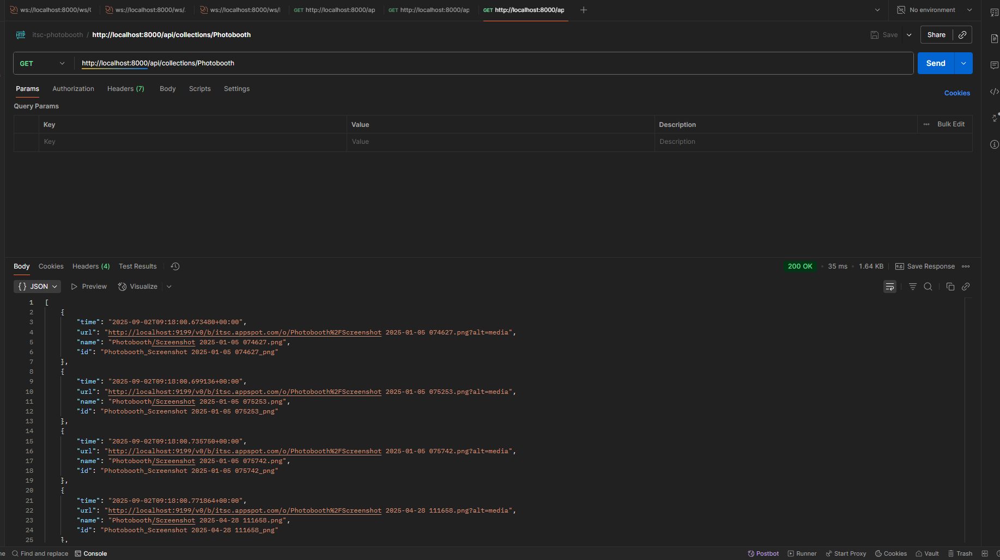

Ngày 31/8/2025-1/9/2025:
Test trước trong folder Original.
Trước khi test cần:
B1. Chạy server db firebase local
B2. Cho một số file vào folder Original.
B3. Chạy trước file APIcalling trong routes.
B4. Vào postman để test API bằng link: ```ws://localhost:8000/ws/Original``
B5. Chạy file TrackingFolder.py.
B6. Vào trong postman để xem kết quả được trả về
Nhận xét về kết quả cho ra: 
- Thỏa mãn về điều kiện thời gian thời gian từ mới nhất đến những cái cũ được đưa vào.
- Thỏa mãn về đường link được đưa ra để sử dụng. 
Yếu điểm:
- Chưa đưa ra được chỉ mỗi url.
- Chưa phản ứng đến trường hợp bị crash.
Hình ảnh khi test được:

Sau khi áp dụng dùng dưới websocket thì hình ảnh khi ra ở đây:

Cho thấy code hoạt động rất ổn trong việc đây dữ liệu vào và khá là mượt mà mặt dù có một chút giật giật khi đẩy ảnh vào nhưng xem như không đáng kể.

Hiện tại thì cần phải testing cho AIService. Thêm folder photobooth và đẩy lại những khám phá cho bên FE để thêm vào cho kịp tiến độ (1/9/2025)

Ngày 2/9/2025:
- Testing thêm 2 đường dẫn: ```ws://localhost:8000/ws/Photobooth`` , ```ws://localhost:8000/ws/AIService```.
Thì bài test vẫn có thể thông qua như cách collection client Original hoạt động và có thể dùng các phương pháp trình chiếu như cách mà Original được trình chiếu.
    - Đầu ra như sau:
        
        
- Đánh giá về thời gian: Sự sai lệch gần như không có thậm chí là không đáng kể. Liên tục cập nhập các phần tử được thêm vào thông qua client của firestore.
- Testing với HTTP GET:
    - Đầu ra như sau: 
        
        
        
- Đánh giá sơ bộ ban đầu thì thấy: API chạy bình thường khi mỗi lần được gọi vào.